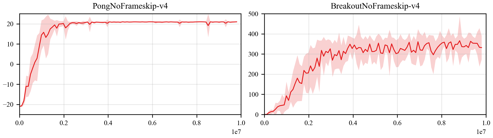

## Paper Result Drawing Tool
This is a python script to draw results for reinforcement learning (based on matplotlib).
## How to use
### 1. File Structure
root_path  
&emsp;&emsp;|----algrithm_1  
&emsp;&emsp;&emsp;&emsp;&emsp;|------env_1  
&emsp;&emsp;&emsp;&emsp;&emsp;|&emsp;&emsp;&emsp;|------csv_1  
&emsp;&emsp;&emsp;&emsp;&emsp;|&emsp;&emsp;&emsp;|------csv_2  
&emsp;&emsp;&emsp;&emsp;&emsp;|&emsp;&emsp;&emsp;|------csv_3  
&emsp;&emsp;&emsp;&emsp;&emsp;|  
&emsp;&emsp;&emsp;&emsp;&emsp;|------env_2  
&emsp;&emsp;&emsp;&emsp;&emsp;&emsp;&emsp;&emsp;&nbsp;|------csv_1  
&emsp;&emsp;&emsp;&emsp;&emsp;&emsp;&emsp;&emsp;&nbsp;|------csv_2  
&emsp;&emsp;&emsp;&emsp;&emsp;&emsp;&emsp;&emsp;&nbsp;|------csv_3  

&emsp;&emsp;&emsp;&emsp;&emsp;...  

&emsp;&emsp;|----algrithm_2  
&emsp;&emsp;&emsp;&emsp;&emsp;...  

### 2. Config
#### 2.1 General Config
general config is saved in `general_config.py`, which is used to save the commonly used **env-specific** configuration for some **pre-defined environments**. Any environment can be append to this config files (such as 'atari', 'mujoco' ...)
#### 2.2 Task Config
task config is responsible for specific tasks. 
- `'subplot'`: (n_rows, n_columns), defining the layout of subgraphs.
- `'root_path'`: (str), root_path of training results.
- `'algorithms'`: (list), name of all algorithms. The named showed here should be same with the folder name under `root_path/`.
- `'envs'` (list), name of all environments. The named showed here should be same with the folder name under `root_path/algorithm_name/`.
- `'line_labels'`: (list), name of all algorithms to generate the **legend** for the graph. It should also satisfy that `len(line_labels) == len(algorithms)`.
- `'reference_window_size'`: (int), The reference window size for data smoothing.
- `'window_size_increase_rate'` (float), We would adjust the smoothing window size according to the point-density of origin data points. Data with larger point-density will get larger smoothing window size.
- `'env_steps'`: (list), used to limit the boundary of axis `x` for each subgraph. It should also satisfy that `len(env_steps) == len(envs)`.
- `'output_name'`: (str), output file name, such as `'result.pdf'`

### 3. Start Drawing
```bash
python draw_benchmark.py
```

### 4. Version Changes

**2021.5.24:** To produce the template below, we disabled some of the functions:

1. legends
2. x label and y label
3. minor loc

<p align="center">

</p>
